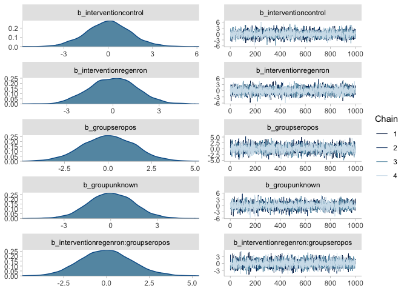
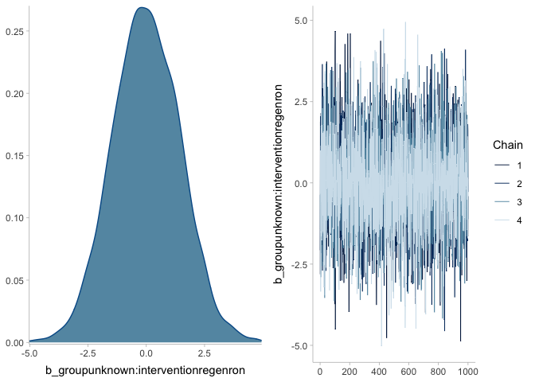
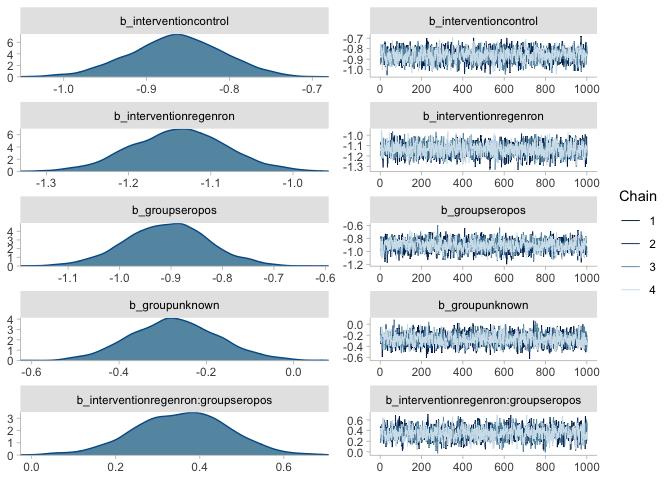
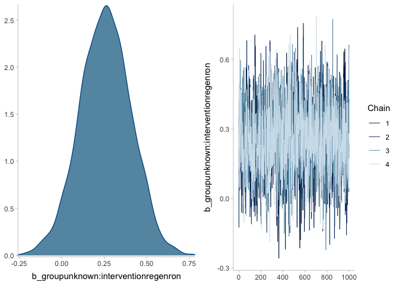
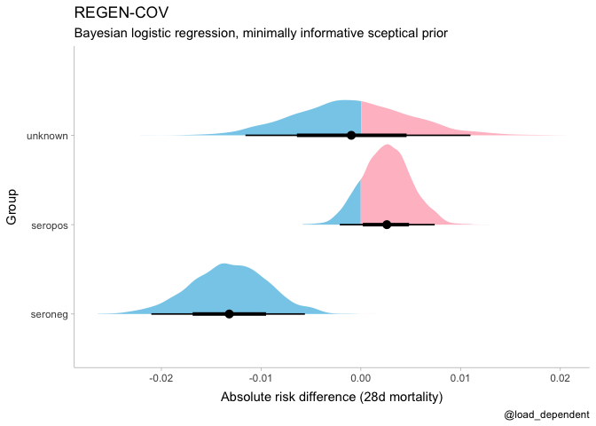

RECOVERY REGEN-COV Bayesian reanalysis
================
Lars Mølgaard Saxhaug
6/25/2021

#### Setup

``` r
library(tidyverse)
library(brms)
library(tidybayes)
library(here)
theme_set(theme_tidybayes())
```

#### Data entry

``` r
regenron <- tribble(
  ~"group", ~"intervention", ~"death", ~"n",
  "seropos", "regenron", 411, 2636,
  "seropos", "control", 383, 2636,
  "seroneg", "regenron", 396, 1633,
  "seroneg", "control", 451, 1520,
  "unknown", "regenron", 137, 570,
  "unknown", "control", 192, 790
) %>% mutate(across(where(is.character), as.factor))
```

#### Sample prior

``` r
mr_prior <- brm(death | trials(n) ~ 0 + intervention * group, # formula without intercept
  family = binomial(), data = regenron,
  prior = prior(normal(0, 1.5), class = "b"),
  sample_prior = "only",
  file = here("model_fits", "mr_prior"),
  file_refit = "on_change"
)
summary(mr_prior)
```

    ##  Family: binomial 
    ##   Links: mu = logit 
    ## Formula: death | trials(n) ~ 0 + intervention * group 
    ##    Data: regenron (Number of observations: 6) 
    ## Samples: 4 chains, each with iter = 2000; warmup = 1000; thin = 1;
    ##          total post-warmup samples = 4000
    ## 
    ## Population-Level Effects: 
    ##                                   Estimate Est.Error l-95% CI u-95% CI Rhat
    ## interventioncontrol                   0.01      1.49    -2.92     2.98 1.00
    ## interventionregenron                  0.01      1.53    -2.87     2.99 1.00
    ## groupseropos                          0.03      1.49    -2.92     2.94 1.00
    ## groupunknown                          0.04      1.48    -2.88     2.95 1.00
    ## interventionregenron:groupseropos    -0.02      1.49    -2.90     3.06 1.00
    ## interventionregenron:groupunknown     0.01      1.47    -2.93     2.87 1.00
    ##                                   Bulk_ESS Tail_ESS
    ## interventioncontrol                   5281     3106
    ## interventionregenron                  5736     2904
    ## groupseropos                          5755     2798
    ## groupunknown                          5663     3251
    ## interventionregenron:groupseropos     5337     2688
    ## interventionregenron:groupunknown     5554     2736
    ## 
    ## Samples were drawn using sampling(NUTS). For each parameter, Bulk_ESS
    ## and Tail_ESS are effective sample size measures, and Rhat is the potential
    ## scale reduction factor on split chains (at convergence, Rhat = 1).

``` r
plot(mr_prior)
```

<!-- --><!-- -->

#### Sample model

``` r
mr <- brm(death | trials(n) ~ 0 + intervention * group,
  family = binomial(),
  data = regenron,
  prior = prior(normal(0, 1.5), class = "b"),
  file = here("model_fits", "mr"),
  file_refit = "on_change"
)

summary(mr)
```

    ##  Family: binomial 
    ##   Links: mu = logit 
    ## Formula: death | trials(n) ~ 0 + intervention * group 
    ##    Data: regenron (Number of observations: 6) 
    ## Samples: 4 chains, each with iter = 2000; warmup = 1000; thin = 1;
    ##          total post-warmup samples = 4000
    ## 
    ## Population-Level Effects: 
    ##                                   Estimate Est.Error l-95% CI u-95% CI Rhat
    ## interventioncontrol                  -0.86      0.06    -0.98    -0.75 1.00
    ## interventionregenron                 -1.14      0.06    -1.26    -1.03 1.00
    ## groupseropos                         -0.91      0.08    -1.07    -0.76 1.00
    ## groupunknown                         -0.27      0.10    -0.47    -0.08 1.00
    ## interventionregenron:groupseropos     0.36      0.11     0.14     0.58 1.00
    ## interventionregenron:groupunknown     0.25      0.15    -0.04     0.55 1.00
    ##                                   Bulk_ESS Tail_ESS
    ## interventioncontrol                   1980     2457
    ## interventionregenron                  2800     2430
    ## groupseropos                          2049     2583
    ## groupunknown                          2226     2449
    ## interventionregenron:groupseropos     2062     2423
    ## interventionregenron:groupunknown     2200     2398
    ## 
    ## Samples were drawn using sampling(NUTS). For each parameter, Bulk_ESS
    ## and Tail_ESS are effective sample size measures, and Rhat is the potential
    ## scale reduction factor on split chains (at convergence, Rhat = 1).

``` r
plot(mr, ask = FALSE)
```

<!-- --><!-- -->

#### Comptute and plot posterior for absolute difference

``` r
regenron %>% # original data
  modelr::data_grid(group, intervention) %>% # generate new data
  mutate(n = 1) %>% # n is the number of trials
  add_fitted_draws(mr) %>% # compute draws from the linear predictor for model `mr`, replace with `mr_prior` for prior prediction
  mutate(.value = brms::inv_logit_scaled(.value)) %>% # inverse logit transformation to probability scale
  compare_levels(.value, by = intervention, fun = `-`) %>% # calculate absolute risk reduction per group
  ggplot(aes(x = .value, y = group, fill = after_stat(ifelse(x > 0, "over", "under")))) +
  stat_halfeye() +
  scale_fill_manual(values = c("over" = "pink", "under" = "skyblue")) +
  theme(legend.position = "none") +
  scale_y_discrete(name = "Group") +
  scale_x_continuous(name = "Absolute risk difference (28d mortality)") +
  labs(title = "REGEN-COV", subtitle = "Bayesian logistic regression, minimally informative sceptical prior", caption = "@load_dependent")
```

<!-- -->

#### Posterior probality of ANY benefit, per group

``` r
regenron %>%
  modelr::data_grid(group, intervention) %>%
  mutate(n = 1) %>%
  add_fitted_draws(mr) %>%
  compare_levels(.value, by = intervention) %>%
  mutate(or = exp(.value)) %>%
  group_by(group) %>%
  summarise(`Probability of superiority` = mean(or < 1)) %>%
  mutate(group=str_to_title(group)) %>% 
  knitr::kable(col.names = c("Group","Probability of superiority"))
```

| Group   | Probability of superiority |
|:--------|---------------------------:|
| Seroneg |                    0.99975 |
| Seropos |                    0.15125 |
| Unknown |                    0.56750 |
